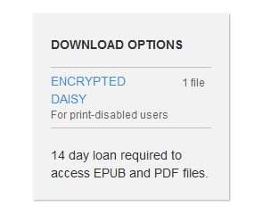
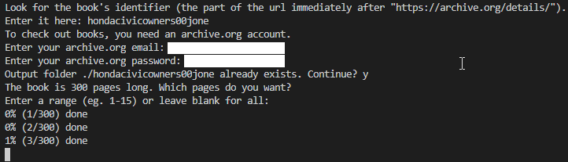
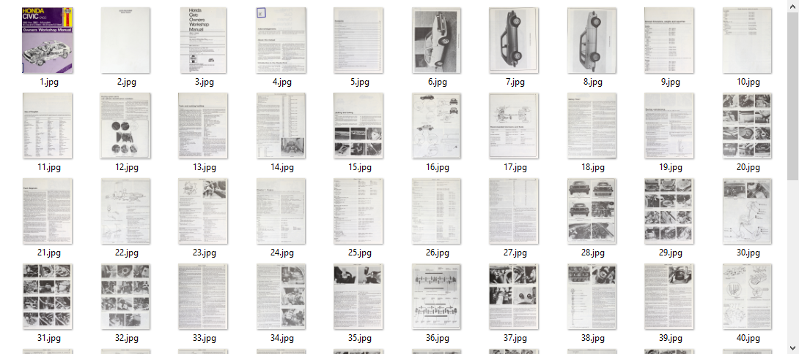

# Archive.org Ripper

This script lets you download books page-by-page from [archive.org](https://archive.org) in the event that there is no PDF link. Any book with a <14 day loan period is like this, as you can see:

The script needs your login credentials to borrow the book, then it will run on its own using your session.

Do not use this program in an illegal manner. Thanks!

## Screenshots

## Planned Features

- Searching for books instead of inputting id directly

- GUI

- Option to convert to pdf or epub instead of saving each page individually
